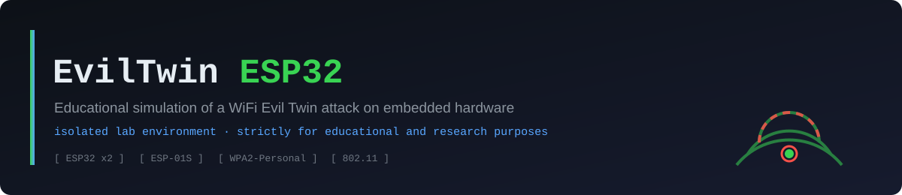
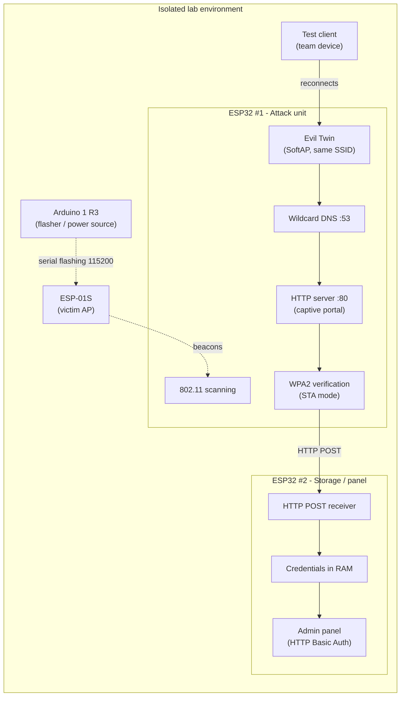

<div align="center">



# 📡 EvilTwin ESP32

**Simulation of a WiFi Evil Twin attack built on two ESP32 boards**, run entirely inside an isolated lab environment to demonstrate — real structural weaknesses in **WPA2‑Personal**.

Originally built as a vocational‑degree final project (Spain's *Grado Medio SMR*).


📖 *[Leer esta documentación en español](https://github.com/joaks07/Proyecto-EvilTwin-ESP32)*

</div>

---

## ⚠️ Legal & ethical notice — read before continuing

> - The author **accepts no responsibility** for any misuse, illegal use, or unauthorized use of the material in this repository.
> - Full legal context and responsible‑use guidance live in only in Spain need to check the law on your own country **[docs/07-security-and-legal-framework.md](docs/07-security-and-legal-framework.md)**.

## 📎 About this repository's scope

This repository holds the project's **full technical documentation**: architecture, firmware design, the attack's network flow, issues found and fixed during development, and a technical glossary. **It does not ship the firmware source (`.ino`/`.cpp`) as a deliverable of this version** — it does ship the complete functional specification (each function's name, purpose, and contract) that the firmware was built against, so the design is fully reproducible by anyone comfortable with Arduino/ESP‑IDF. Publishing the full firmware source is tracked as a future milestone (see [Roadmap](docs/09-limitations-and-roadmap.md)).

---

## 📑 Table of contents

1. [Introduction](#-introduction)
2. [Goals](#-goals)
3. [Features](#-features)
4. [Project architecture](#️-project-architecture)
5. [Hardware used](#-hardware-used)
6. [Software used](#-software-used)
7. [Requirements](#-requirements)
8. [Installation & lab setup](#️-installation--lab-setup)
9. [Configuration](#-configuration)
10. [Usage](#-usage)
11. [Repository structure](#-repository-structure)
12. [Firmware design](#-firmware-design)
13. [Testing performed](#-testing-performed)
14. [Limitations](#-limitations)
16. [Future improvements / Roadmap](#️-future-improvements--roadmap)
16. [Troubleshooting](#-troubleshooting)
17. [References](#-references)
18. [License](#-license)
19. [Authors & credits](#-authors--credits)
20. [Contributing](#-contributing)

---

## 🧭 Introduction

An **Evil Twin** is a rogue WiFi access point that clones the `SSID` — and optionally the `BSSID` — of a legitimate network to impersonate it. Client devices reconnect to the twin automatically whenever it offers a stronger signal, or once they've been forced off the real access point by a deauthentication attack.

The attack works because **802.11 / WPA2‑Personal** has two structural gaps:

- **No mutual authentication**: the client proves it knows the password, but the access point never proves its identity back. Nothing stops another device from broadcasting the same `SSID`.
- **Silent auto‑reconnect**: modern operating systems reconnect to the strongest known `SSID` in range without asking the user first.

This project implements that attack end‑to‑end — scanning, deauthentication, Evil Twin, captive portal, credential verification, and logging — using **two ESP32 boards** with distinct roles, running against a **self‑contained, isolated test network** (an ESP‑01S standing in for the "victim network," flashed via an Arduino UNO). Extended write‑up in [docs/01-introduction.md](docs/01-introduction.md).

## 🎯 Goals

- Demonstrate, on real hardware, the missing mutual authentication in WPA2‑Personal.
- Understand and document the full Evil Twin flow across layers: link layer (802.11/deauth), network layer (DNS wildcarding), and application layer (HTTP/captive portal).
- Apply distributed‑architecture thinking to embedded hardware by splitting responsibilities across two microcontrollers.
- Practice sound technical documentation and responsible security disclosure.

## ✨ Features

- Active scanning of nearby WiFi networks, ranked by signal strength (RSSI).
- Crafting of 802.11 deauthentication management frames (`0xC0`).
- A rogue access point (*SoftAP*) that clones the target's SSID.
- A wildcard DNS server that forces the captive‑portal prompt on iOS and Android.
- Real‑time verification of the submitted password against the legitimate access point.
- A remote admin panel with HTTP Basic Auth and a live view of captured attempts.
- MAC‑address allowlisting to keep the portal visible only to team devices during demos.
- A two‑device architecture that works around the ESP32's single‑radio constraint.

## 🏗️ Project architecture

The system is built from **two ESP32 boards** with distinct roles, plus a **test environment** based on an ESP‑01S flashed via an Arduino UNO.

| Device | Role |
|---|---|
| **ESP32 #1** | Attack unit: scanning · deauthentication · Evil Twin · captive portal · credential verification |
| **ESP32 #2** | Storage & panel unit: receives over HTTP POST · stores in RAM · web panel with basic auth |
| **"Victim network"** | An ESP‑01S configured as an isolated access point, dedicated to the lab |



The two‑device split exists because **a single ESP32 WiFi radio can't reliably scan/attack and serve an admin panel at the same time** — a shared‑radio hardware constraint, not a CPU one (the ESP32 is dual‑core). Full detail in [docs/02-hardware-architecture.md](docs/02-hardware-architecture.md).

## 🔩 Hardware used

| Component | Qty | Required | Description |
|---|:---:|:---:|---|
| **ESP32** (dual‑core, WiFi, 240 MHz, 520 KB SRAM) | 2 | ✅ | One for the attack unit (ESP32 #1), one for storage/panel (ESP32 #2) |
| **ESP‑01S** (ESP8266) | 1 | ✅ | Stands in as the "victim network" inside the isolated test environment |
| **Arduino UNO R3** | 1 | ✅ | Programmer and power source for the ESP‑01S |
| **Jumper wires (Dupont)** | 20+ | ✅ | Every connection is solderless |
| **Status LED** | 1 | ✅ | Wired to `GPIO2` on ESP32 #1, indicates attack state |
| **3D‑printed case** | 1 | ⬜ Optional | Thingiverse model [`thing:4667813`](https://www.thingiverse.com/thing:4667813) |

## 💻 Software used

| Item | Detail |
|---|---|
| Development environment | Arduino Web IDE (or the desktop Arduino IDE) |
| Framework | ESP32 Core **2.x** (C++14) |
| Board package (ESP32) | Espressif's ESP32 board support |
| Board package (ESP‑01S) | ESP8266 board support |
| ESP32 libraries | `WiFi.h` · `WebServer.h` · `DNSServer.h` · ESP‑IDF APIs (e.g. `esp_wifi_ap_get_sta_list()`) |
| ESP‑01S libraries | `ESP8266WiFi.h` (ESP8266 board package) |

## ✅ Requirements

- Two ESP32 boards and one ESP‑01S, plus an Arduino UNO R3 to flash the latter.
- Arduino IDE (or Arduino Web IDE) with the ESP32 and ESP8266 board packages installed.
- A test client device (phone or laptop) **owned by the team**, to validate the captive‑portal flow.
- A physically isolated space where the "victim" AP won't interfere with real networks or bystanders.
- Working knowledge of C++ for Arduino, 802.11 networking, and DNS/HTTP (see the [Glossary](docs/06-glossary.md)).

## 🛠️ Installation & lab setup


1. **Set up the Arduino toolchain**
   - Install the **ESP32** board package (Espressif), Core 2.x.
   - Install the **ESP8266** board package (needed for the ESP‑01S).
   - Confirm `WiFi.h`, `WebServer.h`, and `DNSServer.h` are available (bundled with the ESP32 core).
2. **Implement and flash the ESP32 #1 firmware** (attack unit), following the function spec in [docs/03-firmware-design.md](docs/03-firmware-design.md).
3. **Implement and flash the ESP32 #2 firmware** (storage/panel) onto the second board.
4. **Flash the ESP‑01S** (lab victim network):
   - Wire it to the Arduino UNO R3 at **3.3 V** (5 V will permanently damage it).
   - `GPIO0` to **GND before power‑on** (flash mode).
   - Arduino `RESET` to **GND** during flashing.
   - Upload at **115200 baud**.
5. **First boot**: power all three devices inside the isolated environment. The LED on ESP32 #1 reports status (see the table under [Usage](#-usage)).

Wiring diagrams and electrical notes live in [docs/02-hardware-architecture.md](docs/02-hardware-architecture.md).

## ⚙️ Configuration

| Parameter | Where it's set | Notes |
|---|---|---|
| SSID/password for ESP32 #1's admin AP | ESP32 #1 firmware | Must be changed from any sample value before use |
| Allowlisted MAC addresses | ESP32 #1 firmware (`esp_wifi_ap_get_sta_list()`) | Limits which devices can see the portal during a demo |
| Panel username/password (HTTP Basic Auth) | ESP32 #2 firmware | Change before any live demonstration |
| Fixed WiFi channel before transmitting management frames | ESP32 #1 firmware (`esp_wifi_set_channel()`) | See the [technical limitation](docs/05-issues-and-fixes.md) |
| Automatic rescan interval | ESP32 #1 firmware (`loop()`) | 15 seconds in the original implementation |

## 🚀 Usage

### Connecting to the interface

1. **ESP32 #1** brings up its own admin AP on boot.
2. From a team device (already allowlisted by MAC), connect to that AP.
3. Visit **`/admin`** (authentication‑protected) for the attacker's control panel.
4. The **ESP32 #2** panel is served separately, protected with HTTP Basic Auth and auto‑refreshing, showing captured credentials live.

### ESP32 #1 HTTP routes

| Route | Function |
|---|---|
| `/` | Captive portal: renders the form and processes submissions |
| `/admin` | Admin panel (protected): network selection, deauth, and Evil Twin control |
| `/result` | Checks whether the submitted password was correct and logs the attempt |
| `/rescan` | Forces an immediate network rescan |
| *anything else* | Redirects (captive‑portal behavior) — triggers native detection on iOS/Android |

### Status LED (`GPIO2`)

| LED state | Meaning |
|---|---|
| Off | Idle |
| Slow blink | Deauthentication in progress |
| Fast blink | Evil Twin active |
| Solid on | Credential captured |

### A typical demo walkthrough

1. **Scan** — the panel lists nearby networks ranked by RSSI.
2. **Select** — pick the target network *inside the lab* from `/admin`.
3. **Deauth** — trigger deauthentication (see the [technical limitation](docs/05-issues-and-fixes.md)).
4. **Evil Twin** — spin up the rogue AP with the same SSID, no password required.
5. **Capture** — the client hits the captive portal and enters the password.
6. **Verify** — ESP32 #1 checks the password against the real AP.
7. **Log** — the result is forwarded to ESP32 #2 and shows up on its panel.

Full phase‑by‑phase network flow in [docs/04-network-flow.md](docs/04-network-flow.md).

## 📁 Repository structure

```
Proyecto-EvilTwin-ESP32-English/
├── README.md                          <- this document
├── LICENSE                            <- MIT license
├── CONTRIBUTING.md                    <- contribution guide
├── CHANGELOG.md                       <- version history
├── .gitignore
└── docs/
    ├── 01-introduction.md             <- overview and educational goals
    ├── 02-hardware-architecture.md    <- physical components and wiring
    ├── 03-firmware-design.md          <- firmware functional specification
    ├── 04-network-flow.md             <- the attack, phase by phase
    ├── 05-issues-and-fixes.md         <- issues found and fixed during development
    ├── 06-glossary.md                 <- project technical terms
    ├── 07-security-and-legal-framework.md <- ethics, legality, and responsible use
    ├── 08-testing-and-results.md      <- functional validation performed
    ├── 09-limitations-and-roadmap.md  <- known limitations and future work
    ├── 10-faq.md                      <- frequently asked questions
    └── images/
        └── banner.svg
```

## 🧩 Firmware design

The full function‑by‑function specification for **ESP32 #1** (attack unit) lives in [docs/03-firmware-design.md](docs/03-firmware-design.md), including the documented `wifi_send_pkt_freedom()` limitation and its researched workaround (`esp_wifi_80211_tx()` plus an override of `ieee80211_raw_frame_sanity_check()`).


## 🧪 Testing performed

Summary of the functional validation carried out during development; full detail in [docs/08-testing-and-results.md](docs/08-testing-and-results.md):

- Successful compilation and flashing of both ESP32 boards and the ESP‑01S, after resolving encoding and STL issues (see [Issues and fixes](docs/05-issues-and-fixes.md)).
- Verified scanning of nearby networks with correct RSSI ranking inside the isolated environment.
- Confirmed the native "network requires sign‑in" prompt fires on both iOS and Android once wildcard DNS is active.
- Verified password checks against the real AP via `WiFi.status() == WL_CONNECTED`.
- Verified credential receipt and display on the ESP32 #2 panel over HTTP POST.
- Deauthentication **not verified end‑to‑end on real hardware** within the capstone project's scope: `wifi_send_pkt_freedom()` isn't exposed in Core 2.x (see [Limitations](#-limitations)).

## 🚧 Limitations

- **Real deauth not implemented in the capstone version**: `wifi_send_pkt_freedom()` isn't exposed by the ESP32 Arduino Core 2.x. A researched workaround (`esp_wifi_80211_tx()` plus overriding the IDF's sanity check) is documented in [docs/05-issues-and-fixes.md](docs/05-issues-and-fixes.md), pending integration and hardware validation.
- **RAM‑only persistence**: captured credentials on ESP32 #2 are lost on reboot; there's no flash (SPIFFS/LittleFS) or SD storage.
- **No HTTPS on the panel**: the admin panel uses HTTP Basic Auth without transport encryption, so the panel's own credentials travel as unencrypted Base64 inside the lab network.
- **No WPA3‑SAE support**: the project focuses exclusively on the structural weakness of WPA2‑Personal.
- **Documentation‑only repository**: the full firmware source isn't published in this version (see [scope](#-about-this-repositorys-scope)).


## 🆘 Troubleshooting

Full log of real issues and their fixes in [docs/05-issues-and-fixes.md](docs/05-issues-and-fixes.md): Unicode‑encoding compile failures, `std::vector` incompatibility under C++14, ESP‑01S flashing timeouts, and the `wifi_send_pkt_freedom()` limitation.


## 📚 References

- [ESP32Marauder](https://github.com/justcallmekoko/ESP32Marauder) — offensive/defensive WiFi & Bluetooth toolkit for ESP32; reference for the deauth workaround.
- [Jeija/esp32-80211-tx](https://github.com/Jeija/esp32-80211-tx) — hand‑building 802.11 frames with Espressif's official API.
- [GANESH-ICMC/esp32-deauther](https://github.com/GANESH-ICMC/esp32-deauther) — the `ieee80211_raw_frame_sanity_check()` override.
- [espressif/esp-idf #6368](https://github.com/espressif/esp-idf/issues/6368) and [#8472](https://github.com/espressif/esp-idf/issues/8472) — Espressif‑documented behavior of `esp_wifi_80211_tx()`.
- Official [Espressif ESP32](https://docs.espressif.com/projects/esp-idf/en/stable/esp32/) docs and the [Arduino core for ESP32](https://docs.espressif.com/projects/arduino-esp32/en/latest/).
- Spanish Organic Law 10/1995 (Criminal Code) — art. 264 bis, cited for legal context.

## 📄 License

This project is distributed under the **MIT License** — see [LICENSE](LICENSE).

MIT was chosen for being a permissive, widely recognized, easy‑to‑understand license that favors educational reuse, carries an explicit "as is" warranty disclaimer particularly relevant to a project of this offensive/educational nature, and stays compatible with a future release of the full firmware without restricting study or adaptation.

## 👤 Authors & credits

- **Author:** ([@joaks07](https://github.com/joaks07)[@JRXsec](https://github.com/JRXsec))
- **Origin:** Capstone project — Vocational degree in Microcomputer Systems and Networks (SMR, Spain), Computer Security module.
- **Credits:** the [ESP32Marauder](https://github.com/justcallmekoko/ESP32Marauder), [Jeija/esp32-80211-tx](https://github.com/Jeija/esp32-80211-tx), and [GANESH-ICMC/esp32-deauther](https://github.com/GANESH-ICMC/esp32-deauther) communities for their public research on raw 802.11 frame transmission on the ESP32.

## 🤝 Contributing

This is currently a personal technical‑documentation project. Contributions — corrections, documentation improvements, firmware design proposals — are welcome under [CONTRIBUTING.md](CONTRIBUTING.md). Any contribution must preserve the project's strictly educational, lab‑only focus.

---

<div align="center">


</div>
