# Step-by-Step Laboratory Setup Guide

> **Disclaimer:** This guide is intended exclusively for educational purposes within an authorized and controlled laboratory environment. Do not replicate this setup on networks you do not own or have explicit written permission to test.

---

## Required Hardware

- **2x ESP32 boards** (ESP32-WROOM-32D recommended; Wi-Fi capability is mandatory)
- **2x USB Type-C cables** capable of data transfer (charging-only cables will not work)
- **A computer** with sufficient resources to run the Arduino IDE

---

## 1. Install the Arduino IDE

Download the Arduino IDE from the official website:

<https://docs.arduino.cc/software/ide/>

Once installed, complete all prerequisite steps prompted by the installer before proceeding.

---

## 2. Configure the ESP32 Board Package

1. Open **File > Preferences**.

   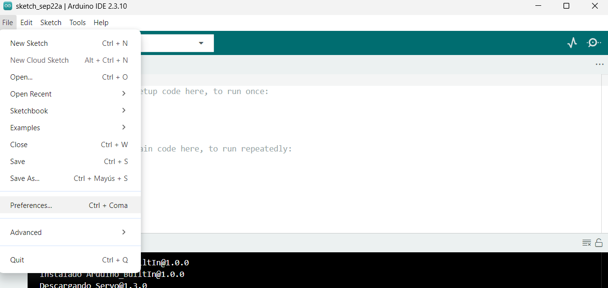

2. In the **Additional Boards Manager URLs** field, add the following URL to enable ESP32 board support:

   ```
   https://espressif.github.io/arduino-esp32/package_esp32_index.json
   ```

   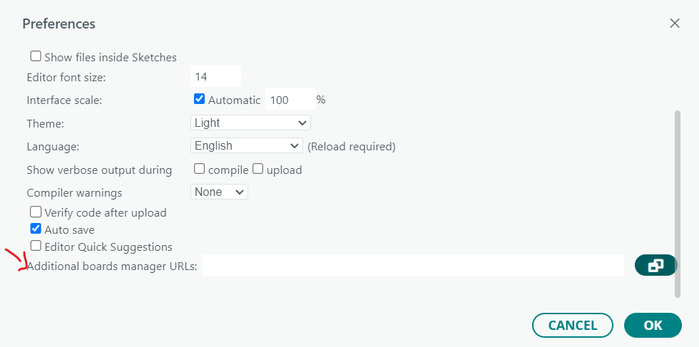

3. Navigate to **Tools > Board > Boards Manager**.

   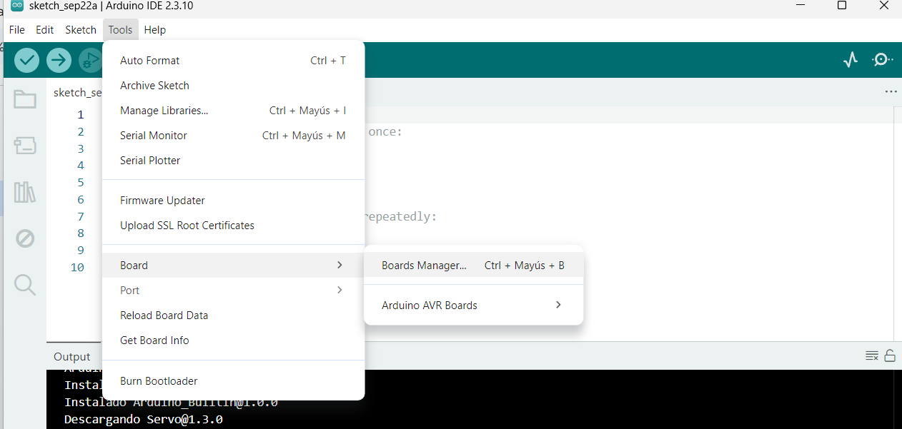

4. Search for and install **"esp32 by Espressif Systems"**.

   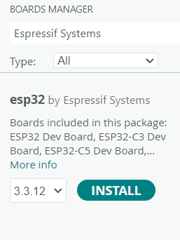

5. Once installed, go to **Tools > Board** and select the appropriate board. In this case, select **ESP32 Dev Module**.

   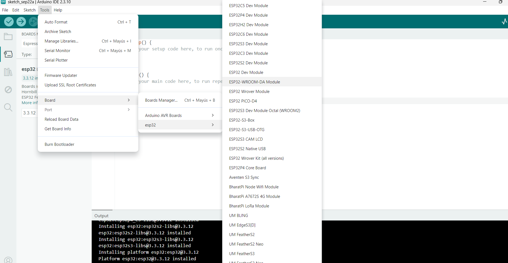

---

## 3. Connect the ESP32

Plug the ESP32 into your computer via the USB cable. Under **Tools > Port**, a COM port should appear. Select it to establish communication with the board.

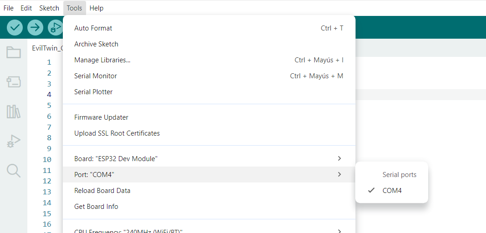

You can also verify the connection through the **Device Manager**.

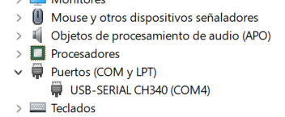

---

## 4. Verify Required Libraries

Before uploading the main firmware, compile a minimal test sketch to confirm that all required libraries are available.

Open a new sketch, paste the following code, and click **Verify** (the checkmark icon in the upper-left corner):

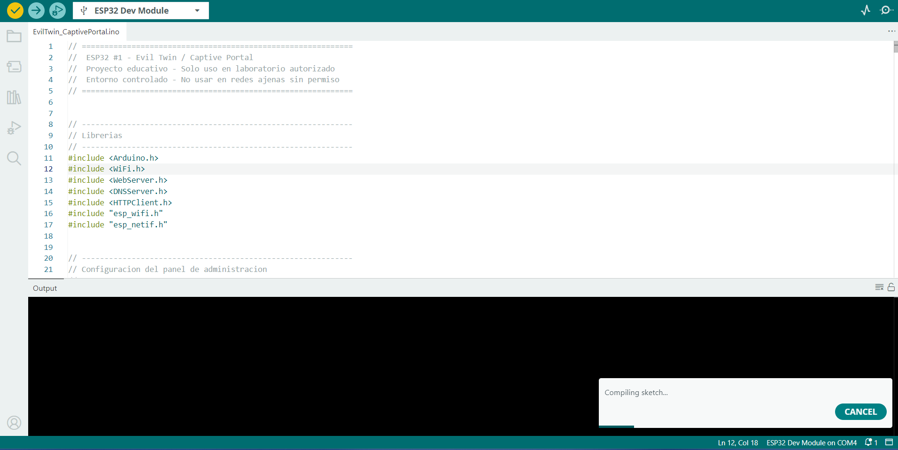

```cpp
#include <WiFi.h>
#include <WebServer.h>
#include <DNSServer.h>
#include "esp_wifi.h"

void setup() {
  Serial.begin(115200);
}

void loop() {
}
```

If compilation succeeds without errors, all necessary libraries are present.

---

## 5. Upload the Captive Portal Firmware (ESP32 #1)

Open the Captive Portal firmware file (`EvilTwin_CaptivePortal.ino`) and upload it to the first ESP32 by clicking the **Upload** button.

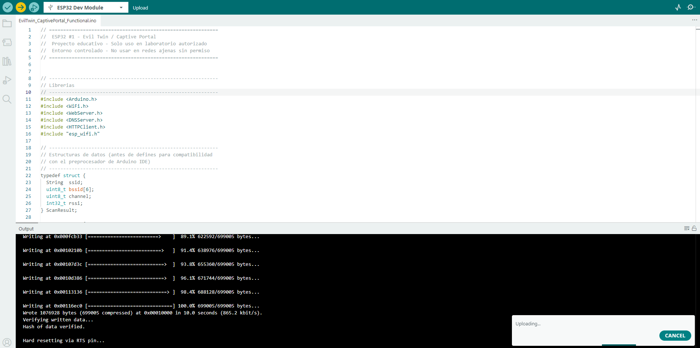

---

## 6. Access the Captive Portal Admin Panel (ESP32 #1)

1. From any device, connect to the Wi-Fi network named **EvilTwin-Admin**.
2. When the authentication prompt appears, enter the following credentials:

   | Field    | Value       |
   |----------|-------------|
   | Username | `admin`     |
   | Password | `change_me` |

   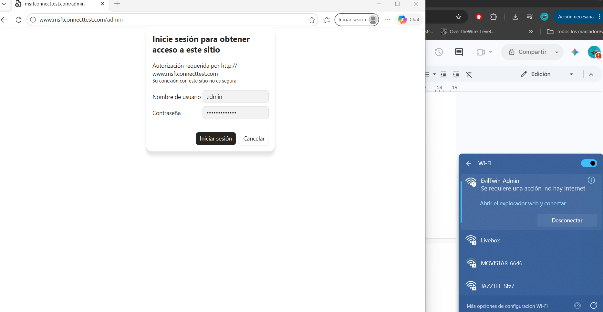

3. The Captive Portal control panel should now be visible.

   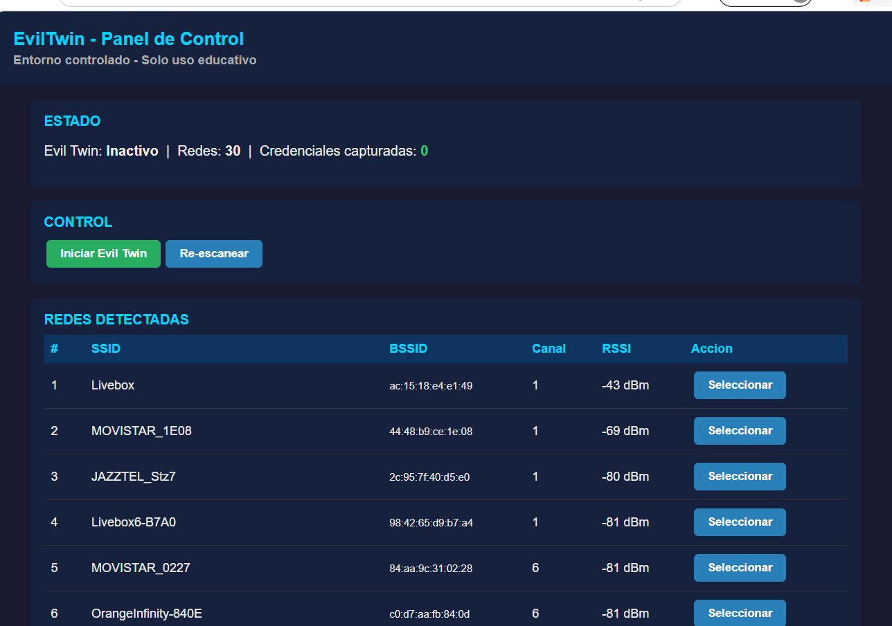

---

## 7. Access the Exfiltrator Panel (ESP32 #2)

1. Upload the Exfiltrator firmware (`ESP32_Exfiltrador.ino`) to the second ESP32.
2. From a separate device (e.g., a mobile phone), connect to the following Wi-Fi network:

   | Field    | Value       |
   |----------|-------------|
   | SSID     | `Livebox`   |
   | Password | `tryharder` |

3. A login page should open automatically. If it does not, navigate manually to:

   ```
   http://192.168.10.1/recv
   ```

4. Enter the panel credentials:

   | Field    | Value     |
   |----------|-----------|
   | Username | `admin`   |
   | Password | `labpass` |

This panel displays all captured credentials received from ESP32 #1.

---

## 8. Select a Target Network and Launch the Attack

> **Important:** Only select a network that you own or have explicit authorization to test.

1. In the Captive Portal admin panel (ESP32 #1), select the target network from the list. In this example, a personal home network is used to avoid any legal issues.

   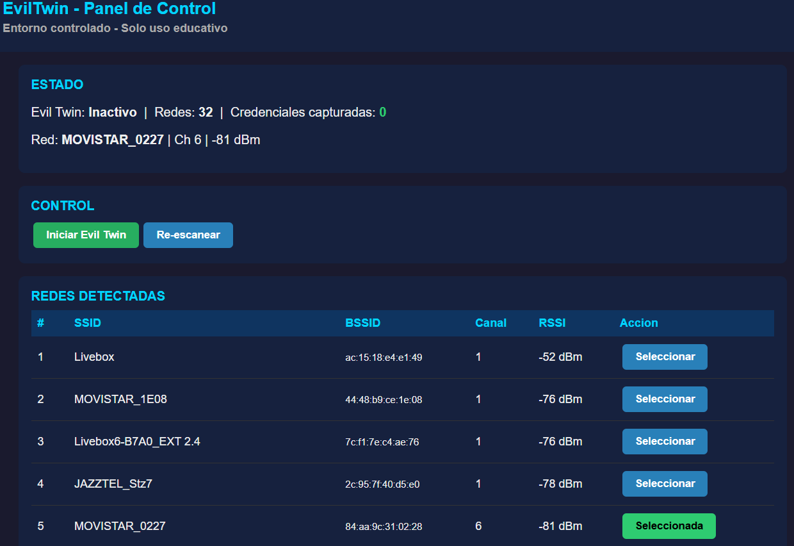

2. Click **Start Evil Twin**.
3. You will be disconnected from ESP32 #1 as it begins cloning the target network.

---

## 9. Test the Cloned Network

Once the Evil Twin is active, any device scanning for available networks will see a duplicate SSID matching the cloned network. Upon connecting, a login page will appear automatically.

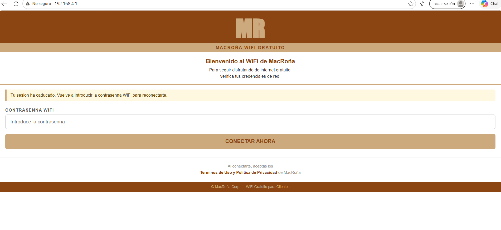

This login page is built with basic HTML and CSS for demonstration purposes. You are free to customize it or create more realistic templates by editing the HTML section within the `EvilTwin_CaptivePortal.ino` firmware file. Usernames, passwords, and network names can also be modified to suit your requirements.

---

## 10. Verify Credential Capture

When a credential is entered on the cloned network's captive portal, it will be transmitted to ESP32 #2. You can verify successful capture by:

- Checking the **Exfiltrator panel** on your mobile device (ESP32 #2), where the credential will appear in the list.
- Observing the **blue LED** on ESP32 #2: it blinks while waiting for credentials and remains solid once a credential has been received.

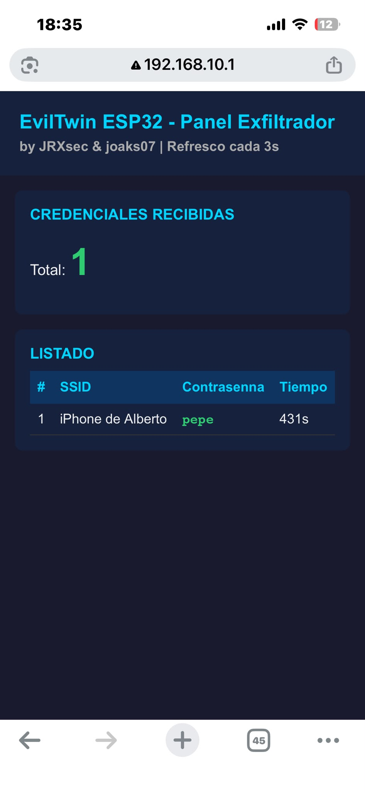

---

## Summary

| Step | Action                                  |
|------|-----------------------------------------|
| 1    | Install the Arduino IDE                 |
| 2    | Add ESP32 board support                 |
| 3    | Connect ESP32 via USB                   |
| 4    | Verify required libraries               |
| 5    | Upload Captive Portal firmware (ESP32 #1) |
| 6    | Access the admin panel (ESP32 #1)       |
| 7    | Upload and access the Exfiltrator panel (ESP32 #2) |
| 8    | Select target and launch Evil Twin      |
| 9    | Test the cloned network                 |
| 10   | Verify credential capture               |
